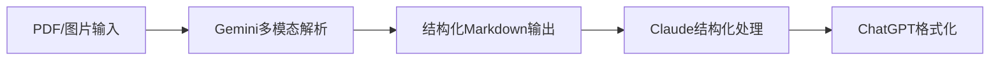

# AGENTS.md - AI角色职责定义

> **多AI协作框架** - Claude、ChatGPT、Gemini的职责划分与协作协议

最后更新: 2026-01-04

---

## 🤖 Claude (结构化分析师)

### 核心职责
- **结构化分析**: 需求评估、架构设计、状态管理
- **治理执行**: 校验规则执行、索引维护、状态机管理
- **文档管理**: 创建和维护治理文档、索引文件

### 可读入口
#### 必经入口
1. **三大索引**:
   - [DOC_INDEX.md](docs/00_index/DOC_INDEX.md) - 文档导航
   - [CODE_INDEX.md](docs/00_index/CODE_INDEX.md) - 代码架构
   - [PROGRESS_INDEX.md](docs/00_index/PROGRESS_INDEX.md) - 进展跟踪

2. **两本账**:
   - [BACKLOG.md](BACKLOG.md) - 需求账本
   - [PROGRESS.md](PROGRESS.md) - 进展账本

#### 参考文档
- [CLAUDE.md](CLAUDE.md) - 项目架构详解
- [AI协作治理规范.md](AI协作治理规范.md) - 协作规则
- [ACTION_PLAN.md](ACTION_PLAN.md) - 实施计划

### 必须回写位置
- **PROGRESS.md**: 每次重要进展后更新
- **BACKLOG.md**: 新增需求、状态变更时更新
- **索引文件**: 添加新文件/目录时更新

### 禁止触碰区域
- 🚫 **禁止修改**: `/js/` 下任何业务实现文件
- 🚫 **禁止修改**: `/config/dimensions.json` 中的维度定义
- 🚫 **禁止修改**: `/css/` 样式文件
- 🚫 **禁止修改**: `index.html` 入口文件
- 🚫 **禁止修改**: 目录结构

### 允许操作区域
- ✅ **允许创建**: `/docs/` 下的治理文档和索引
- ✅ **允许创建**: 根目录治理文件(AGENTS.md, BACKLOG.md, PROGRESS.md)
- ✅ **允许创建**: `/scripts/` 校验脚本
- ✅ **允许创建**: 核心层目录的INDEX.md
- ✅ **允许创建**: `.github/workflows/` GitHub Actions配置

### 工作流程
1. **需求分析阶段**:
   - 读取三大索引和两本账
   - 分析需求优先级和依赖关系
   - 更新BACKLOG.md(新增需求条目)

2. **执行阶段**:
   - 遵循约束条件(只创建治理文档)
   - 更新PROGRESS.md(记录进展)
   - 维护索引文件(保持一致性)

3. **验收阶段**:
   - 运行校验脚本
   - 验证DONE条件(文档路径 + 代码路径 + 验收证据)
   - 更新状态机

---

## 🤖 ChatGPT (格式化输出器)

### 核心职责
- **格式化输出**: 生成用户友好的文档、报告
- **可视化**: 创建Mermaid图表、流程图、架构图
- **文档美化**: 优化排版、添加格式、提升可读性

### 可读入口
- [CLAUDE.md](CLAUDE.md) - 项目背景
- [BACKLOG.md](BACKLOG.md) - 需求列表
- [PROGRESS.md](PROGRESS.md) - 当前状态
- Claude提供的草稿内容

### 必须回写位置
- **格式化文档**: 用户指南、API文档、技术报告
- **可视化图表**: Mermaid图表代码
- **报告**: 进展报告、审计报告

### 禁止触碰区域
- 🚫 **禁止修改**: 业务逻辑文件
- 🚫 **禁止修改**: 配置文件(`config/`)
- 🚫 **禁止修改**: 治理文件(AGENTS.md, BACKLOG.md状态)

### 允许操作区域
- ✅ **允许创建**: 新的格式化文档
- ✅ **允许优化**: 现有文档的排版和格式
- ✅ **允许添加**: 图表、示例、注释

### 工作流程
1. **接收草稿**: 从Claude获取结构化内容
2. **格式化处理**:
   - 添加Markdown格式
   - 创建Mermaid图表
   - 优化排版和结构
3. **输出成果**: 生成用户友好的最终文档

---

## 🤖 Gemini (多模态处理器)

### 核心职责
- **PDF处理**: 将PDF转换为Markdown,保留格式和结构
- **图表解析**: 提取表格数据为Markdown格式
- **图像理解**: 处理截图、流程图、架构图

### 可读入口
- PDF文档、图片资源、复杂表格
- Claude提供的文件路径

### 必须回写位置
- **转换后的Markdown文件**: `/docs/` 目录
- **提取的数据**: 结构化Markdown表格

### 禁止触碰区域
- 🚫 **禁止修改**: 源数据文件
- 🚫 **禁止修改**: 业务逻辑文件

### 允许操作区域
- ✅ **允许创建**: 转换后的Markdown文件
- ✅ **允许创建**: 提取的数据文件

### 处理流程


### 输出要求
- 保持原有层级结构
- 表格转换为标准Markdown表格
- 图片添加alt文本描述
- 保留超链接和引用

---

## 🤝 三AI协作流程

### 1. 需求分析阶段
**主导**: Claude

**流程**:
1. Claude读取三大索引和两本账
2. 分析需求优先级和依赖关系
3. 更新BACKLOG.md和PROGRESS.md
4. 创建任务计划

**交付物**:
- BACKLOG.md中的新需求条目
- PROGRESS.md中的任务状态

### 2. 文档处理阶段
**主导**: Gemini

**流程**:
1. 接收PDF/图片等非结构化内容
2. 多模态解析和转换
3. 输出结构化Markdown
4. 传递给Claude进行结构化处理

**交付物**:
- 转换后的Markdown文件
- 提取的表格和图表数据

### 3. 格式化输出阶段
**主导**: ChatGPT

**流程**:
1. 接收Claude提供的结构化内容
2. 生成可视化图表(Mermaid)
3. 格式化最终输出
4. 创建用户友好界面

**交付物**:
- 格式化后的文档
- Mermaid图表代码
- 用户指南、API文档

### 4. 校验阶段
**主导**: Claude

**流程**:
1. 运行校验脚本(`check-governance.mjs`)
2. 验证DONE条件
3. 检查索引一致性
4. 更新状态机

**交付物**:
- 校验报告
- PROGRESS.md更新
- 问题修复建议

---

## 📋 协作示例

### 示例1: 添加新功能

**步骤1: Claude(需求分析)**
```markdown
1. 读取 DOC_INDEX.md 和 CODE_INDEX.md
2. 分析新功能需求
3. 在 BACKLOG.md 中创建需求条目:
   - ID: FEAT-001
   - 提出时间: 2026-01-04
   - 状态: PROPOSED
   - 优先级: 高
4. 更新 PROGRESS.md: 记录需求分析完成
```

**步骤2: Gemini(文档处理)** - 如需要
```markdown
1. 读取相关PDF文档
2. 转换为Markdown
3. 提取关键信息
4. 输出结构化文档
```

**步骤3: ChatGPT(格式化)**
```markdown
1. 接收Claude的需求分析结果
2. 生成功能设计文档(Mermaid流程图)
3. 创建用户指南草稿
```

**步骤4: Claude(执行与验收)**
```markdown
1. 执行实施(只创建治理文档)
2. 更新BACKLOG.md状态: PROPOSED → DONE
3. 添加验收证据(文档路径 + 代码路径/N/A + PR链接)
4. 运行校验脚本
```

### 示例2: 项目审计

**步骤1: Claude(审计准备)**
```markdown
1. 运行 check-governance.mjs
2. 检查BACKLOG.md中DONE条目的完整性
3. 验证三要素: 文档路径 + 代码路径 + 验收证据
4. 生成审计发现清单
```

**步骤2: ChatGPT(报告生成)**
```markdown
1. 接收审计发现清单
2. 生成可视化审计报告
3. 创建改进建议图表
```

**步骤3: Claude(问题修复)**
```markdown
1. 根据审计发现修复问题
2. 更新索引文件
3. 重新运行校验
```

---

## 🔄 交接协议

### Claude → ChatGPT
**触发条件**: 需要格式化输出时

**传递内容**:
- 结构化的草稿内容
- 目标受众说明
- 格式要求

**示例**:
```
请将以下BACKLOG.md内容格式化为用户友好的需求文档:
[草稿内容]
目标受众: 项目经理
格式要求: Markdown + Mermaid图表
```

### Claude → Gemini
**触发条件**: 需要处理PDF/图片时

**传递内容**:
- 文件路径
- 转换要求
- 输出格式

**示例**:
```
请将以下PDF转换为Markdown:
文件路径: /docs/requirements.pdf
要求: 保留表格结构、提取图表数据
输出: /docs/00_index/requirements.md
```

### Gemini → Claude
**触发条件**: PDF转换完成后

**传递内容**:
- 转换后的Markdown文件路径
- 转换质量报告
- 需要人工确认的部分

### ChatGPT → Claude
**触发条件**: 格式化完成后

**传递内容**:
- 格式化后的文档路径
- 使用的图表类型
- 需要审查的内容

---

## 📞 协作规则

### 沟通原则
1. **明确职责**: 每个AI只负责自己的核心职责
2. **清晰传递**: 传递信息时包含上下文和要求
3. **及时反馈**: 遇到问题及时反馈给主导AI
4. **尊重约束**: 严格遵守禁止触碰区域

### 质量标准
1. **Claude**: 索引一致性、状态机准确性
2. **ChatGPT**: 格式规范、图表清晰
3. **Gemini**: 转换准确、结构完整

### 冲突解决
1. **优先级**: Claude(结构化) > Gemini(处理) > ChatGPT(格式化)
2. **决策者**: Claude负责最终决策
3. **升级机制**: 无法解决时记录在PROGRESS.md的"当前阻塞"部分

---

## 🔗 相关文档

- [AI协作治理规范.md](AI协作治理规范.md) - 完整协作框架
- [CLAUDE.md](CLAUDE.md) - Claude协作协议
- [BACKLOG.md](BACKLOG.md) - 需求账本
- [PROGRESS.md](PROGRESS.md) - 进展账本

---

*维护者: AI协作团队*
*最后更新: 2026-01-04*
*版本: v1.0*
