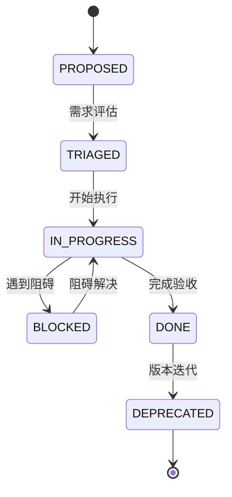
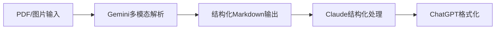

# AI协作治理规范

---

## <Role>
**AI协作治理规范** - 确保可复用、可接力、可审计的协作框架
</Role>

## <Mission>
一次性落实并加固"索引一致性 + 需求/进展账本 + DONE 证据链 + 最小校验机制"
</Mission>

## <Constraints>
- 🔒 **禁止修改业务逻辑**：不得修改 `/src` 下任何业务实现文件
- 🔒 **禁止修改指标口径**：不得修改任何指标口径与数据字典内容  
- 🔒 **禁止目录重构**：严禁修改目录结构
- ✅ **允许治理变更**：仅限 `/开发文档`、根目录治理文件、`scripts`、`.github/workflows`
</Constraints>

---

## 📋 目录导航

1. [仓库盘点协议](#仓库盘点协议)
2. [状态机管理](#状态机管理)
3. [核心层目录规范](#核心层目录规范)
4. [交付物标准](#交付物标准)
5. [校验机制](#校验机制)
6. [AI协作协议](#ai协作协议)

---

## 仓库盘点协议

### <Who>
**主导AI**：Claude（负责结构化分析）
**协作AI**：ChatGPT（负责格式化输出）、Gemini（负责多模态处理）
</Who>

### <What>
#### **第一阶段：必需文件检查**
```markdown
| 文件名 | 路径 | 检查状态 | 优先级 |
|--------|------|----------|--------|
| CLAUDE.md | 根目录 | [ ] 待检查 | 🔴 高 |
| AGENTS.md | 根目录 | [ ] 待检查 | 🔴 高 |
| BACKLOG.md | 根目录 | [ ] 待检查 | 🔴 高 |
| PROGRESS.md | 根目录 | [ ] 待检查 | 🔴 高 |
| project_rules.md | 根目录 | [ ] 待检查 | 🟡 中 |
| DOC_INDEX.md | /开发文档/00_index/ | [ ] 待检查 | 🔴 高 |
| CODE_INDEX.md | /开发文档/00_index/ | [ ] 待检查 | 🔴 高 |
| PROGRESS_INDEX.md | /开发文档/00_index/ | [ ] 待检查 | 🔴 高 |
```

#### **第二阶段：目录结构扫描**
```bash
# 扫描命令（Gemini多模态处理）
find . -type d -maxdepth 4 | head -20
```

**预期核心层目录（自动推断）：**
- `/src/domain` - 核心业务逻辑层
- `/src/application` - 应用服务层  
- `/src/ui` - 用户界面层
- `/开发文档/01_architecture` - 架构设计文档
- `/开发文档/02_kpi_dictionary` - 指标定义文档
- `/开发文档/03_data_contract` - 数据契约文档
- `/开发文档/04_ui_spec` - UI规范文档
- `/开发文档/05_ops_runbook` - 运维手册

#### **第三阶段：唯一事实来源识别**
```markdown
## 📚 权威文档登记（只登记，不改内容）

### 🎯 指标口径文档
- 文件路径：[请填写具体路径]
- 负责人：[请填写]
- 最后更新：[请填写]

### 🎯 数据字典文档  
- 文件路径：[请填写具体路径]
- 负责人：[请填写]
- 最后更新：[请填写]

### 🎯 业务规则文档
- 文件路径：[请填写具体路径]
- 负责人：[请填写]
- 最后更新：[请填写]
```

### <Why>
确保**索引完整性**和**权威性确认**，避免重复工作和版本冲突
</Why>

---

## 状态机管理

### <Role>
**状态管理器**：所有AI必须遵循统一的状态机协议
</Role>

### <StateMachine>


### <DoneRules>
**DONE判定条件（缺一不可）：**

| 条件 | 验证方法 | 示例 |
|------|----------|------|
| **关联文档路径** | 检查文件存在性 | `/开发文档/architecture/api_design.md` |
| **关联代码路径** | git文件存在检查 或 `N/A` | `/src/domain/user/service.js` 或 `N/A` |
| **验收/证据** | 链接可访问性验证 | PR链接、commit哈希、报告路径 |

```yaml
# 校验脚本配置
governance_rules:
  done_validation:
    required_fields:
      - related_docs: "non-empty string"
      - related_code: "non-empty string OR N/A"  
      - evidence: "non-empty string"
    validation_methods:
      - file_exists: "check if path exists"
      - link_accessibility: "check if URL is accessible"
      - git_commit_exists: "verify commit hash"
```

### <Why>
确保**交付可追溯**和**质量可控**，避免虚假完成
</Why>

---

## 核心层目录规范

### <Rule>
**核心层目录标准：**
- 🎯 **强制要求**：目录内有 INDEX.md 或在上级索引明确登记
- 🎯 **数量控制**：选择 4~8 个最关键目录
- 🎯 **推断原则**：基于仓库扫描结果自动推断
</Rule>

### <IndexTemplate>
```markdown
# [目录名称]

## 🎯 目录职责
[1-3 行简洁描述该目录的核心职责]

## 🔗 关键入口
- **主要文件**：[入口文件1](相对路径)
- **配置文件**：[入口文件2](相对路径)
- **测试文件**：[入口文件3](相对路径)

## 📚 全局索引链接
- 📖 [文档索引](../../../开发文档/00_index/DOC_INDEX.md)
- 💻 [代码索引](../../../开发文档/00_index/CODE_INDEX.md)
- 📊 [进展索引](../../../开发文档/00_index/PROGRESS_INDEX.md)

## ⚠️ 约束条件
- 🚫 **禁止修改**：[列出不能修改的文件/目录]
- ✅ **允许操作**：[列出允许的操作类型]

## 📞 联系信息
- **负责人**：[姓名/角色]
- **更新频率**：[如：每迭代/按需]
```

### <ValidationRules>
```yaml
# 核心层目录校验规则
core_directory_validation:
  check_index_file:
    - path: "DIRECTORY/INDEX.md"
    - fallback: "上级索引文件中的明确登记"
  required_content:
    - "目录职责部分（1-3行）"
    - "关键入口部分（至少1个链接）"
    - "全局索引链接（3个必需索引）"
    - "约束条件部分"
```

### <Why>
确保**索引一致性**和**职责清晰**，避免混乱和索引膨胀
</Why>

---

## 交付物标准

### <DeliveryList>

#### **A) 三大入口索引**
```markdown
## 📊 三大入口索引清单

| 索引类型 | 文件路径 | 状态检查 | 最后更新 |
|----------|----------|----------|----------|
| 📖 文档索引 | `/开发文档/00_index/DOC_INDEX.md` | [ ] 待创建 | [ ] |
| 💻 代码索引 | `/开发文档/00_index/CODE_INDEX.md` | [ ] 待创建 | [ ] |
| 📊 进展索引 | `/开发文档/00_index/PROGRESS_INDEX.md` | [ ] 待创建 | [ ] |
```

#### **B) 两本账**
```markdown
## 📔 两本账标准

### BACKLOG.md 格式要求
```yaml
required_fields:
  - ID: "唯一标识符"
  - 提出时间: "YYYY-MM-DD"
  - 板块: "业务域分类"
  - 归属对象: "负责人/团队"
  - 需求描述: "简洁明确的需求说明"
  - 优先级: "高/中/低"
  - 状态: "PROPOSED/TRIAGED/IN_PROGRESS/BLOCKED/DONE"
  - 关联文档: "文档路径（DONE时必填）"
  - 关联代码: "代码路径或N/A"
  - 验收证据: "PR链接/报告路径"
```

### PROGRESS.md 格式要求
```yaml
required_sections:
  - 里程碑: "关键节点和交付物"
  - 当前阻塞: "正在解决的问题"
  - 下一步接力: "明确的状态机转换指令"
```

#### **C) 目录索引**
每个核心层目录必须包含 INDEX.md（见上方模板）

#### **D) AI协作协议**
详见下方 [AI协作协议](#ai协作协议) 部分

#### **E) 校验机制**
详见下方 [校验机制](#校验机制) 部分

### <Why>
确保**交付标准化**和**质量可控**，便于接力协作
</Why>

---

## 校验机制

### <Role>
**校验执行者**：可配置为 Node.js 或 Python 环境
</Role>

### <EnvironmentSelection>
```bash
# 环境检测逻辑
if [ -f "package.json" ]; then
    echo "选择 Node.js 环境"
    SCRIPT_PATH="scripts/check-governance.mjs"
elif [ -f "requirements.txt" ] || [ -f "pyproject.toml" ]; then
    echo "选择 Python 环境"  
    SCRIPT_PATH="scripts/check-governance.py"
else
    echo "默认选择 Node.js 环境"
    SCRIPT_PATH="scripts/check-governance.mjs"
fi
```

### <ValidationRules>
```yaml
# 必须实现的校验规则
governance_checks:
  # 1. 根目录文件存在性
  root_files:
    required:
      - "CLAUDE.md"
      - "AGENTS.md" 
      - "BACKLOG.md"
      - "PROGRESS.md"
    optional:
      - "project_rules.md"
      - "GEMINI.md"

  # 2. 三大索引存在性  
  index_files:
    required:
      - "/开发文档/00_index/DOC_INDEX.md"
      - "/开发文档/00_index/CODE_INDEX.md" 
      - "/开发文档/00_index/PROGRESS_INDEX.md"

  # 3. 核心层目录索引
  core_directories:
    check_method: "INDEX.md存在 OR 上级索引登记"
    auto_discovery: true
    max_directories: 8

  # 4. BACKLOG.md DONE规则
  backlog_validation:
    done_rules:
      - related_docs: "非空检查"
      - evidence: "非空检查"
      - related_code: "非空检查 OR N/A"
```

### <ScriptOutput>
```bash
# 成功输出格式
✅ 治理校验通过
📊 统计信息：
   - 根目录文件：8/8 通过
   - 索引文件：3/3 通过  
   - 核心目录：6/6 通过
   - BACKLOG条目：12/12 通过

# 失败输出格式  
❌ 治理校验失败
🔍 错误详情：
   1. 缺失文件：AGENTS.md（根目录）
   2. 索引错误：/开发文档/00_index/CODE_INDEX.md 不存在
   3. BACKLOG条目 #5：缺少关联文档路径
   4. 核心目录 /src/ui：缺少 INDEX.md
```

### <CIIntegration>
```yaml
# GitHub Actions 工作流示例
name: Governance Check
on: [push, pull_request]
jobs:
  governance:
    runs-on: ubuntu-latest
    steps:
      - uses: actions/checkout@v3
      - name: Setup Node.js
        uses: actions/setup-node@v3
        with:
          node-version: '18'
      - name: Run governance check
        run: node scripts/check-governance.mjs
```

### <Why>
确保**规则可执行**和**质量自动化**，降低人工维护成本
</Why>

---

## AI协作协议

### <ClaudeProtocol>
```markdown
# CLAUDE.md - Claude协作协议

## 🚪 必经入口
- 首先读取三大索引：DOC_INDEX.md、CODE_INDEX.md、PROGRESS_INDEX.md
- 其次检查两本账：BACKLOG.md、PROGRESS.md

## 🛡️ 护栏机制
- 🚫 **禁止修改**：任何 `/src` 下的业务实现文件
- 🚫 **禁止修改**：指标口径、数据字典内容
- 🚫 **禁止修改**：目录结构
- ✅ **允许操作**：仅在 `/开发文档`、根目录治理文件中操作

## 📋 交付协议  
- 新增需求必须先进 BACKLOG.md
- DONE 必须满足三个条件：文档路径 + 代码路径 + 验收证据
- 涉及核心层改动必须更新对应 INDEX.md

## 🔧 工具使用
- 优先使用 TodoWrite 工具跟踪任务状态
- 使用 SearchCodebase 工具避免重复工作
- 遵循状态机转换规则
```

### <ChatGPTProtocol>
```markdown
# AGENTS.md - ChatGPT角色职责定义

## 🤖 Claude (结构化分析师)
- **可读入口**：三大索引 + 两本账
- **必须回写位置**：PROGRESS.md、BACKLOG.md  
- **禁止触碰区域**：`/src`、指标文档、数据字典
- **核心职责**：结构化分析、状态管理、校验执行

## 🤖 ChatGPT (格式化输出器)
- **可读入口**：CLAUDE.md、BACKLOG.md
- **必须回写位置**：格式化文档、报告
- **禁止触碰区域**：业务逻辑文件、配置文件
- **核心职责**：格式化输出、可视化图表生成

## 🤖 Gemini (多模态处理器)  
- **可读入口**：PDF文档、图片资源、复杂表格
- **必须回写位置**：转换后的Markdown文件
- **禁止触碰区域**：源数据文件
- **核心职责**：PDF转Markdown、图表解析、OCR处理
```

### <GeminiProtocol>
```markdown
# GEMINI.md - Gemini多模态协作协议

## 🖼️ 多模态处理能力
- **PDF处理**：将PDF转换为Markdown，保留格式和结构
- **图表解析**：提取表格数据为Markdown格式
- **图像理解**：处理截图、流程图、架构图

## 🔄 处理流程


## 📋 输出要求
- 保持原有层级结构
- 表格转换为标准Markdown表格
- 图片添加alt文本描述
- 保留超链接和引用
```

### <IntegrationStrategy>
```markdown
## 🤝 三AI协作流程

### 1. 需求分析阶段
**Claude主导**：
- 读取三大索引和两本账
- 分析需求优先级和依赖关系
- 更新BACKLOG.md和PROGRESS.md

### 2. 文档处理阶段  
**Gemini主导**：
- 处理PDF、图片等非结构化内容
- 转换为标准Markdown格式
- 提取表格和图表数据

### 3. 格式化输出阶段
**ChatGPT主导**：
- 生成可视化图表（Mermaid）
- 格式化最终输出
- 创建用户友好界面

### 4. 校验阶段
**Claude执行**：
- 运行校验脚本
- 验证DONE条件
- 更新状态机
```

### <Why>
确保**AI协作清晰**和**职责分明**，最大化各自优势
</Why>

---

## 📞 支持与维护

### <HelpChain>
```markdown
## 🆘 问题解决路径

### 1. 文档问题
- 🔍 检查本文档相关章节
- 📖 查看唯一事实来源文档
- 📊 检查三大索引文件

### 2. 执行问题  
- ✅ 在 BACKLOG.md 中创建问题追踪项
- 🔄 更新 PROGRESS.md 状态
- 📞 联系对应AI角色负责人

### 3. 校验问题
- 🔧 运行本地校验脚本
- 📋 检查错误输出信息
- 🚀 查看CI/CD执行日志
```

### <UpdateProtocol>
```markdown
## 🔄 文档更新协议

### 更新条件
- 发现AI理解偏差
- 业务规则变更
- 工具链升级

### 更新流程
1. 在BACKLOG.md中记录更新需求
2. 分析影响范围
3. 更新文档内容
4. 运行校验验证
5. 更新PROGRESS.md状态
```

---

*最后更新：2026-01-04*  
*版本：v2.0 (AI友好优化版)*  
*维护者：AI协作团队*

---

## 📋 快速检查清单

### <QuickCheck>
```markdown
## ✅ AI协作就绪检查

- [ ] **Claude**：CLAUDE.md已配置，索引可访问
- [ ] **ChatGPT**：AGENTS.md已配置，角色职责明确
- [ ] **Gemini**：GEMINI.md已配置，多模态协议就绪
- [ ] **三大索引**：DOC/CODE/PROGRESS_INDEX.md存在
- [ ] **两本账**：BACKLOG/PROGRESS.md格式正确
- [ ] **校验脚本**：check-governance.mjs/py可执行
- [ ] **核心目录**：INDEX.md文件完整
- [ ] **状态机**：转换规则清晰
```

### <WhenToUse>
**使用时机：**
- 🚀 项目启动时
- 🔄 AI角色切换时  
- 📋 交付前校验时
- 🔍 问题排查时
**使用方法：**
```bash
# 快速检查命令
node scripts/check-governance.mjs --quick-check
```
```