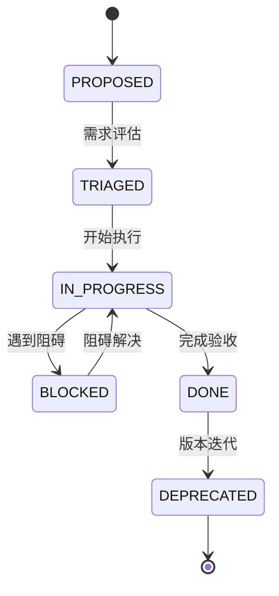

# 进展索引 (PROGRESS_INDEX.md)

> **项目进展跟踪** - 需求、任务、里程碑的统一入口

最后更新: 2026-01-04

---

## 📊 账本链接

### 需求账本
- [BACKLOG.md](../../BACKLOG.md) - 所有需求条目
  - 需求ID、提出时间、优先级
  - 状态机追踪(PROPOSED → TRIAGED → IN_PROGRESS → DONE)
  - 关联文档、代码路径、验收证据

### 进展账本
- [PROGRESS.md](../../PROGRESS.md) - 当前项目状态
  - 里程碑记录
  - 当前阻塞问题
  - 下一步接力计划

---

## 🎯 里程碑

### 已完成 ✅

#### MVP阶段 (2025-12-26)
- [x] 文件上传和解析(支持.xlsx, .xls, .csv)
- [x] 3个核心维度筛选(三级机构、起保月、客户类别)
- [x] 电商式筛选器(draft → applied模式)
- [x] 2个核心图表(月度趋势折线图、TOP5机构柱状图)
- [x] 4个指标卡片
- [x] Web Worker数据处理架构
- [x] 状态管理和事件总线

#### 功能扩展阶段 (2025-12-26)
- [x] 扩展至9个维度支持
- [x] 配置驱动维度系统
- [x] Worker字段映射更新
- [x] 双Y轴趋势图(保费 + 占比)
- [x] 可复用组件体系

#### 治理体系建立 (2026-01-04)
- [x] AI协作治理规范文档
- [x] 三大入口索引(DOC/CODE/PROGRESS_INDEX.md)
- [x] AI协作协议(AGENTS.md)
- [x] 需求账本(BACKLOG.md)
- [x] 进展账本(PROGRESS.md)
- [x] 核心层目录索引(INDEX.md)

---

### 进行中 🚧

#### 当前迭代
详见 [PROGRESS.md](../../PROGRESS.md)

---

### 计划中 📋

#### 下一阶段任务
详见 [BACKLOG.md](../../BACKLOG.md) 中的 `IN_PROGRESS` 和 `TRIAGED` 条目

---

## 🔄 状态机说明

### 状态转换规则

### DONE判定条件
缺一不可的三要素:
1. **关联文档路径**: 设计文档、技术方案等
2. **关联代码路径**: 实现代码路径 或 `N/A`(无需代码)
3. **验收证据**: PR链接、commit哈希、测试报告等

---

## 📈 进度统计

### 需求状态分布
| 状态 | 数量 | 百分比 |
|------|------|--------|
| PROPOSED | - | -% |
| TRIAGED | - | -% |
| IN_PROGRESS | - | -% |
| BLOCKED | - | -% |
| DONE | - | -% |
| DEPRECATED | - | -% |

*实时数据请查看 [BACKLOG.md](../../BACKLOG.md)*

### 里程碑完成情况
| 阶段 | 计划任务 | 已完成 | 完成率 |
|------|----------|--------|--------|
| MVP阶段 | 7 | 7 | 100% |
| 功能扩展 | 5 | 5 | 100% |
| 治理体系 | 6 | 6 | 100% |
| 下一阶段 | - | - | -% |

---

## 🔍 快速导航

### 按角色查看

**👨‍💼 项目经理**:
1. 查看 [PROGRESS.md](../../PROGRESS.md) 了解当前状态
2. 检查 [BACKLOG.md](../../BACKLOG.md) 了解任务分布
3. 查看本索引了解里程碑进度

**👨‍💻 开发者**:
1. 查看 [BACKLOG.md](../../BACKLOG.md) 中的 `IN_PROGRESS` 任务
2. 查看 [PROGRESS.md](../../PROGRESS.md) 中的当前阻塞
3. 领取 `TRIAGED` 状态的任务

**🔍 审计者**:
1. 检查 [BACKLOG.md](../../BACKLOG.md) 中DONE条目的完整性
2. 验证三要素: 文档路径 + 代码路径 + 验收证据
3. 追踪需求从PROPOSED到DONE的全链路

### 按场景查找

**📊 查看项目健康度**:
1. 本索引 → 进度统计 → 完成率
2. PROGRESS.md → 当前阻塞 → 风险评估

**🎯 领取新任务**:
1. BACKLOG.md → 筛选 `TRIAGED` 状态
2. 检查关联文档是否完整
3. 更新状态为 `IN_PROGRESS`

**✅ 验收任务**:
1. BACKLOG.md → 检查DONE三要素
2. 验收证据 → PR/测试报告
3. 更新PROGRESS.md → 里程碑

**🐛 处理阻塞**:
1. PROGRESS.md → 当前阻塞 → 分析原因
2. BACKLOG.md → 更新状态为 `BLOCKED`
3. 解决后 → 更新为 `IN_PROGRESS`

---

## 📞 相关资源

### 规划文档
- [ACTION_PLAN.md](../../ACTION_PLAN.md) - 详细实施计划
- [架构批判报告.md](../../架构批判报告.md) - 技术债务评估
- [DEPLOYMENT_STATUS.md](../../DEPLOYMENT_STATUS.md) - 部署状态

### 治理文档
- [AI协作治理规范.md](../../AI协作治理规范.md) - 协作规则
- [AGENTS.md](../../AGENTS.md) - AI角色职责

### 技术文档
- [CLAUDE.md](../../CLAUDE.md) - 架构设计
- [API.md](../API.md) - 接口文档
- [TESTING_CHECKLIST.md](../../TESTING_CHECKLIST.md) - 测试清单

---

## 🔗 相关索引

- 📖 [文档索引](./DOC_INDEX.md) - 所有文档
- 💻 [代码索引](./CODE_INDEX.md) - 代码组织
- 🎯 [BACKLOG.md](../../BACKLOG.md) - 需求账本
- 📊 [PROGRESS.md](../../PROGRESS.md) - 进展账本

---

## 📝 更新日志

| 日期 | 更新内容 | 更新人 |
|------|----------|--------|
| 2026-01-04 | 创建进展索引,记录MVP和功能扩展阶段里程碑 | AI协作团队 |
| 2025-12-26 | MVP阶段完成 | 开发团队 |
| 2025-12-26 | 功能扩展阶段完成 | 开发团队 |

---

*维护者: AI协作团队*
*更新频率: 每次里程碑完成时*
