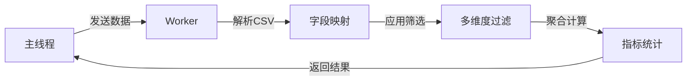

# /js/workers/ - Web Worker层

> **Web Worker数据处理引擎**

最后更新: 2026-01-04

---

## 🎯 目录职责

本目录包含Web Worker脚本,负责所有重度数据计算和处理任务。通过Web Worker在独立线程中运行,避免阻塞主线程,确保UI流畅性。采用一次性监听器模式,防止内存泄漏。

---

## 🔗 关键入口

### 主要文件
- [data.worker.js](data.worker.js) - 数据处理Worker
  - CSV/Excel解析(PapaParse + SheetJS)
  - 多维度筛选(9个维度 × N个值)
  - 指标聚合计算(保费求和、计数)
  - TOP N排名
  - 字段映射(支持多种列名变体)
  - 600+ 行核心逻辑

### 测试文件
- 无(当前无Worker测试)

---

## 📚 全局索引链接
- 📖 [文档索引](../../docs/00_index/DOC_INDEX.md)
- 💻 [代码索引](../../docs/00_index/CODE_INDEX.md)
- 📊 [进展索引](../../docs/00_index/PROGRESS_INDEX.md)

---

## ⚠️ 约束条件

### 禁止修改
- 🚫 **禁止修改**: 核心数据处理逻辑(已通过性能测试)
- 🚫 **禁止修改**: 字段映射逻辑
- 🚫 **禁止修改**: 筛选和聚合算法
- 🚫 **禁止修改**: 一次性监听器模式

### 允许操作
- ✅ **允许操作**: 添加新的计算函数
- ✅ **允许操作**: 优化现有算法性能
- ✅ **允许操作**: 添加新的Worker消息类型

### 设计原则
- **独立线程**: 所有数据处理在Worker中执行
- **内存安全**: 一次性监听器自动清理
- **性能优先**: 优化大数据集处理
- **不可变数据**: 不修改原始数据,返回新对象

---

## 📊 代码统计

| 文件 | 行数 | 状态 | 复杂度 |
|------|------|------|--------|
| data.worker.js | ~600 | ✅ 稳定 | 高 |

---

## 🎯 Worker通信协议

### 消息类型
```javascript
// 1. 解析CSV/Excel
{
  type: 'parse-csv',
  data: { file: File, config: Object }
}
// 响应: { type: 'parse-complete', data: { rows: Array, stats: Object } }

// 2. 应用筛选
{
  type: 'apply-filters',
  data: { rows: Array, filters: Object }
}
// 响应: { type: 'filter-complete', data: { filteredRows: Array } }

// 3. 计算指标
{
  type: 'calculate-metrics',
  data: { rows: Array, dimension: String }
}
// 响应: { type: 'metrics-complete', data: { metrics: Array } }

// 4. TOP N排名
{
  type: 'get-top-n',
  data: { rows: Array, dimension: String, n: Number }
}
// 响应: { type: 'top-n-complete', data: { topN: Array } }
```

### WorkerBridge使用示例
```javascript
// 发送消息(一次性监听器)
WorkerBridge.sendMessage('apply-filters', data, (result) => {
  console.log('Filtered rows:', result.filteredRows);
  // 监听器自动清理
});
```

---

## 🎯 数据处理流程



### 筛选逻辑
- **维度间**: AND逻辑(所有条件必须满足)
- **维度内**: OR逻辑(任一值匹配即可)

### 性能优化
- 使用Transferable Objects传递大数据
- 避免深拷贝,使用结构化克隆
- 分批处理大数据集(>10000行)

---

## 📞 联系信息
- **负责人**: 性能优化团队
- **更新频率**: 极少(核心逻辑稳定)
- **相关文档**: [CLAUDE.md](../../CLAUDE.md) - Worker通信模式

---

*维护者: 性能优化团队*
*最后更新: 2026-01-04*
